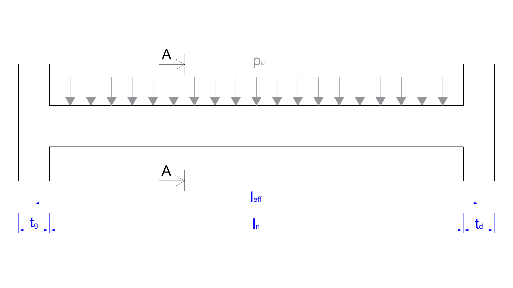
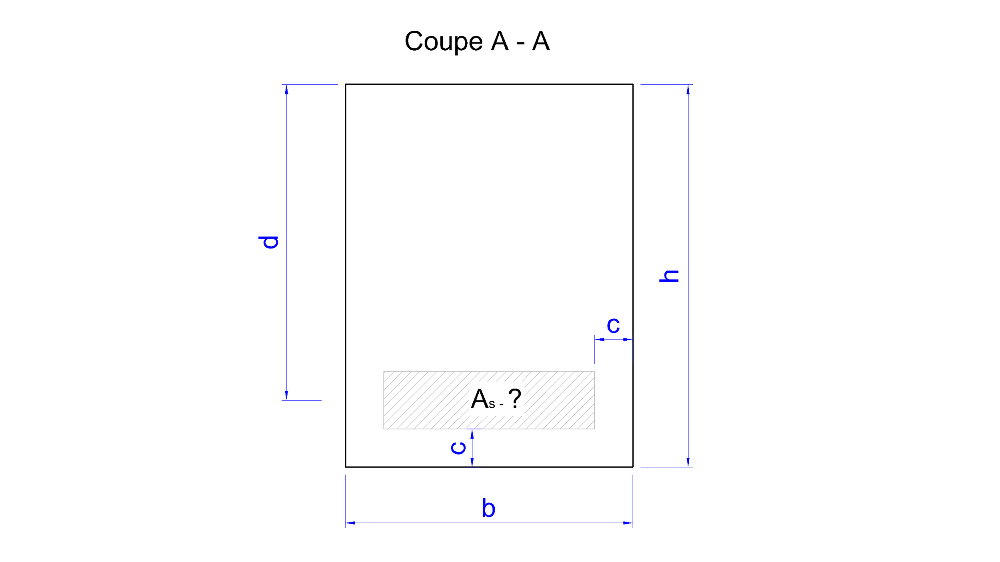
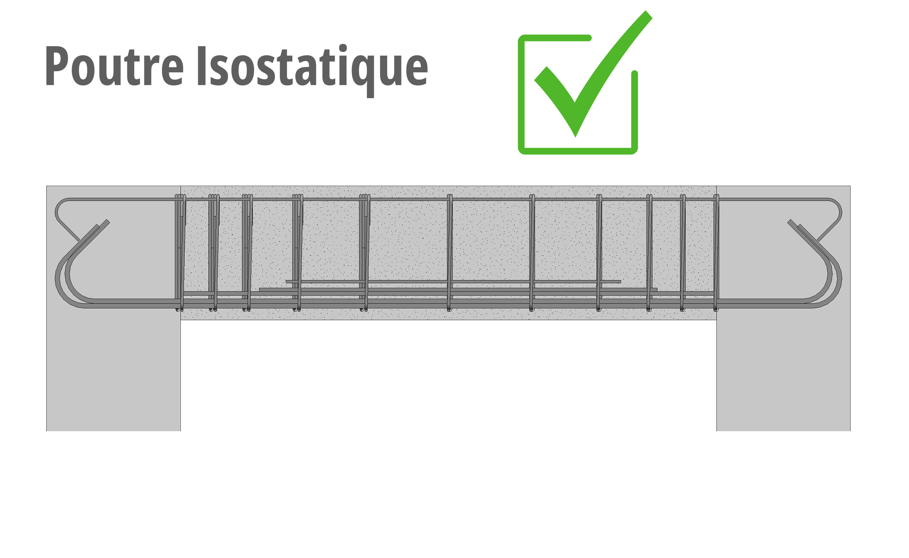

# 🧱 Outil de Calcul Automatique : Section d'Acier des Poutres en Béton Armé (Eurocode 2)

Cet outil open source permet de calculer automatiquement la section d’acier nécessaire pour les **poutres isostatiques rectangulaires en flexion simple**, conformément à l’**Eurocode 2 (NF EN 1992-1-1 / EC2)**.  
Il s’adresse aux ingénieurs, étudiants en génie civil, architectes et passionnés de construction.

## 🚀 Fonctionnalités
- ✅ Dimensionnement automatique des poutres selon l’Eurocode 2  
- 📊 Calcul de la section d’acier (As), contraintes et moments fléchissants  
- 🔎 Vérification de l’enrobage (c et c_min) via un outil complémentaire  
- 🖥️ Interface simple et intuitive  
- 🔓 Outil libre, gratuit et accessible à tous  

## 🛠️ Comment ça marche ?
1. **Charges** : saisissez les charges permanentes (Gu) et d’exploitation (Q) en kN/m issues de la descente des charges.  
2. **Dimensions** : indiquez la largeur (b) et la hauteur (h) de la poutre.  
3. **Acier** : précisez le type d’acier et le diamètre des cadres transversaux.  
4. **Enrobage** : utilisez l’outil dédié pour déterminer la valeur correcte selon EC2.  
5. **Résultats** : obtenez automatiquement le diamètre, le nombre de barres, leur espacement et la hauteur utile de la section (d).



## ⚠️ Avertissements
- Cet outil est destiné aux **poutres isostatiques rectangulaires en flexion simple**.  
- Non adapté aux poutres continues ou à géométrie complexe.  
- Les calculs fournis sont **préliminaires** : une validation finale par un **bureau d’études agréé** est indispensable.  
- Les auteurs n’assument aucune responsabilité en cas d’utilisation inappropriée.



## 🤝 Contributions
Ce projet est ouvert aux contributions : corrections, améliorations, traductions.
Merci de créer une issue ou une pull request si vous souhaitez participer. 

## 📜 Licence
Distribué sous licence MIT.
Vous êtes libre d’utiliser, modifier et partager ce code dans le respect des termes de la licence.

## 🌍 Vision & Bien commun
Cet outil fait partie d’une initiative visant à rendre les méthodes de calcul du béton armé (selon Eurocode 2) accessibles librement au plus grand nombre.
Il contribue à l’interopérabilité, à l’ouverture des ressources pédagogiques et à la démocratisation des normes européennes dans le domaine de la construction.

Pour accéder à la version complète avec le ferraillage automatique des arrêts de barres, des ancrages de chaque lit d'acier, du diamètre de mandrin et du retour pour le façonnage des barres selon les exigences de l'EC2, consultez [beton-guide.com](https://beton-guide.com/calcul/calcul-poutres-beton-arme-eurocode2-logiciel-gratuit-en-ligne.html).

## 📦 Installation
Aucune installation nécessaire : il s’agit d’un outil web.  
Vous pouvez l’utiliser directement en ligne ou cloner le dépôt :  

```bash
git clone https://github.com/Damon201202/ec2-poutres.git
cd ec2-poutres
